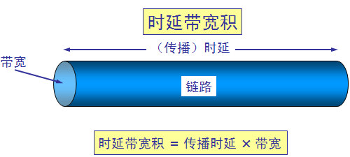

## 计算机网络(一) 计算机网络概述
## 王道烩 2018.9.22

### 局域网

覆盖比较小，教室里面的交换机需要借口多，称作**接入层设备**，每一个带宽不需要很高。但是机房里面将多个教室里的交换机汇聚起来接到互联网，需要的口不是很多，但是每个口带宽需要比较大，这些是**汇聚层设备**。

### Internet 和广域网

跨运营商的话进行访问会比较缓慢，所以有些在每一个运营商都放一个服务器，在下载的时候可能会看到选择怎么下载。或者使用双线机房。

广域网距离比较远，主要是花钱买服务，有其他人维护。 

### 计算机数据通信的过程

网站的网页是如何到达客户端的：

全球唯一，统一规划的是公网IP。IP地址有网络部分和主机部分。其中子网掩码告诉了哪些是网络部分哪些是主机部分。

**网关**就是告诉想要去其他网段需要给谁。

各个接口有自己的**MAC地址**，也称**物理地址**，全球唯一的。

IP地址决定最终要到哪里去，用来寻路，MAC地址决定下一跳要到哪里去，主要是在数据链路层进行工作。

在不同路由器之间进行传输的时候，**需要修改的是MAC地址**，**IP地址部分不用动**。也就是数据包不变，但是数据帧需要改变。

服务器在向客户发送响应的时候，先将网页分段，然后对应的一个一个发送给客户端。

### OSI参考模型

- 应用层：能够产生网络流量的程序
- 表示层：在传输内容之前，可能需要加密，压缩等，程序开发员做的事情
- 会话层：在访问不同的网站要建立不同的会话，要能够交互。长时间未访问可关闭会话。可以通过会话来查除木马
- 传输层：可靠传输，流量控制，还可以不可靠传输。一个包的话可以使用不可靠传输。
- 网络层：负责选择最佳路径，分配IP地址。
- 数据链路层：帧的开始和结束。如果帧中间出现和结尾一样的，需要在前面加上转义的位，实现透明传输，同时还可以进行差错校验。
- 物理层：网络设备的借口标准，电气标准。如何在物理链路上更快地传输。

分层的好处：改变不同的层不会影响其他的层，同时大家的设备只要服从标准，就能够相互连接。每一层较为独立。

不同层时间，下一层为上一层提供服务。一太计算机可以使用多个IP。网络出现故障的时候，需要从下往上排除故障。

#### 网络排错指导
- 物理层故障：查看连接状态，发送和接受的数据包
- 数据链路层故障： MAC故障，欠费是数据链路层的问题，网速没法协商一致。
- 网络层故障：规划地址，选择路径。配置错误的IP地址，子网掩码，错误的网关，路由器没有配置到达目的地的路径。
- 应用层故障：应用程序配置错误，如浏览器配置了错误的代理。

### TCP/IP协议栈

### 计算机网络的性能

#### 1.速率

数据位的速率。一般说的带宽是按照位说的，单位是bps kbps Mbps 。一般显示的
是字节速率，为B/s，kB/s。一般要除以8.

#### 2.带宽

信道能够传送的最高数据率。

#### 3.吞吐量

单位时间通过某个网络的数据量。双向的话需要相加。

#### 4.时延

#### 5.时延带宽积

表示链路上的数据量是多少。

#### 6.往返时延(RRT)

从发送方发送数据开始，到发送方收到接收方确认。

#### 7.网络利用率

