## 计算机网络(二) 物理层
## 王道烩 2018.9.22

### 基本概念

物理层主要解决如何在各种计算机的传输媒体上传输数据比特流。主要任务是确定传输媒体的接口的一些特性：

- 机械特性
- 电气特性
- 功能特性
- 过程特性

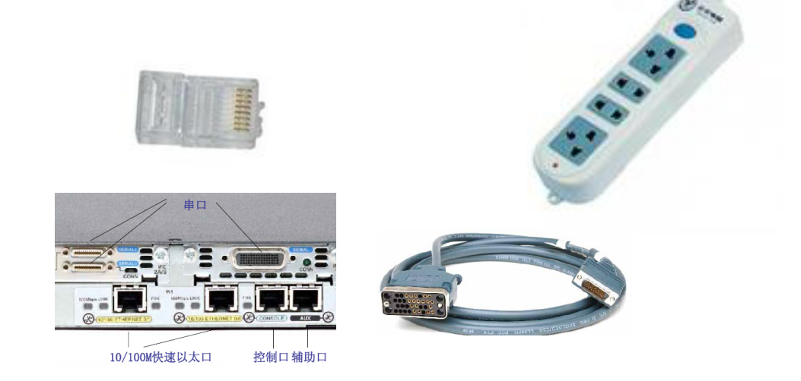

### 数据通信的基础知识

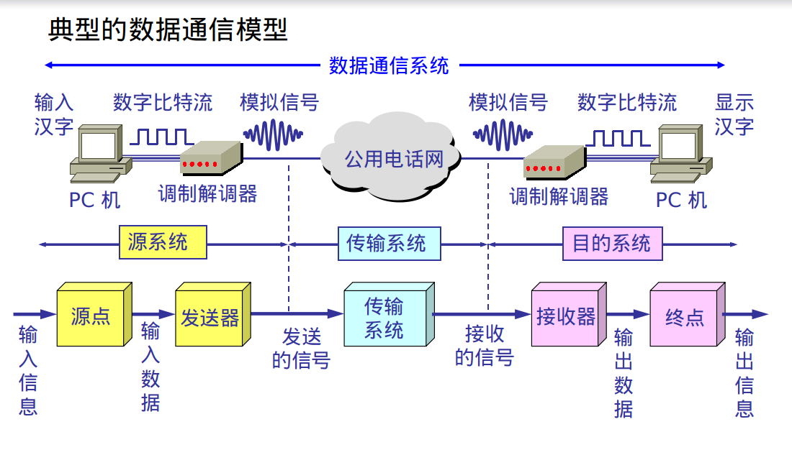

#### 信道

- 单向通信：只有一个方向的通信
- 半双工通信：可以发动和接受，但不能通知发送
- 全双工通信：可以同时发送和接受

#### 基带信号

- 基带信号：来自信源的信号，直接表达了要传输的信息的信号。
- 带通信号：基带信号进行载波调制后，把信号的频率范围搬移到较高的频段。

在传输距离较近时，采用基带信号传输，传输较远时，需要调制解调。

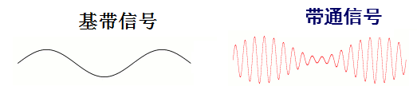

#### 调制方法

- 调幅
- 调频
- 调相

#### 常用编码

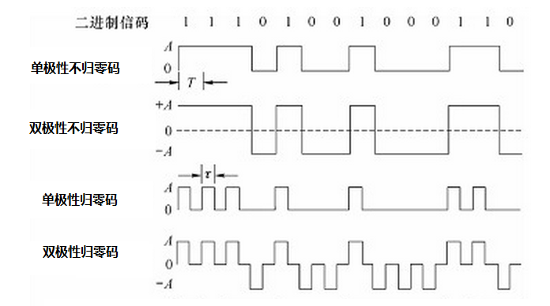

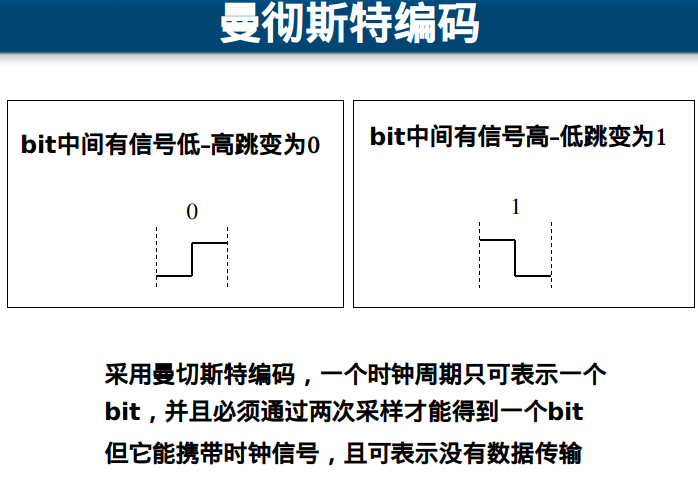

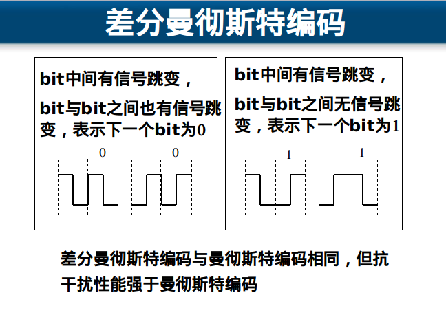

#### 信道极限容量

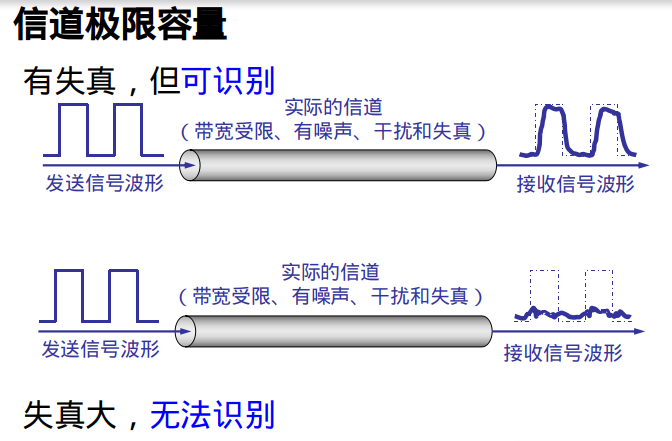

#### 信噪比

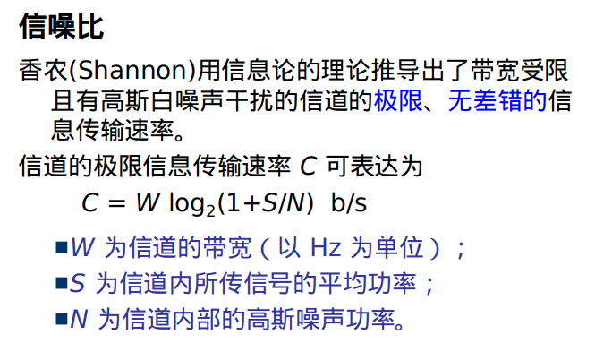

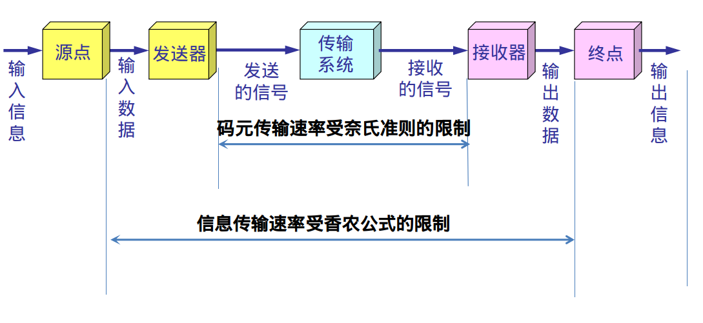

### 物理层下面的传输媒体

#### 导向传输媒体

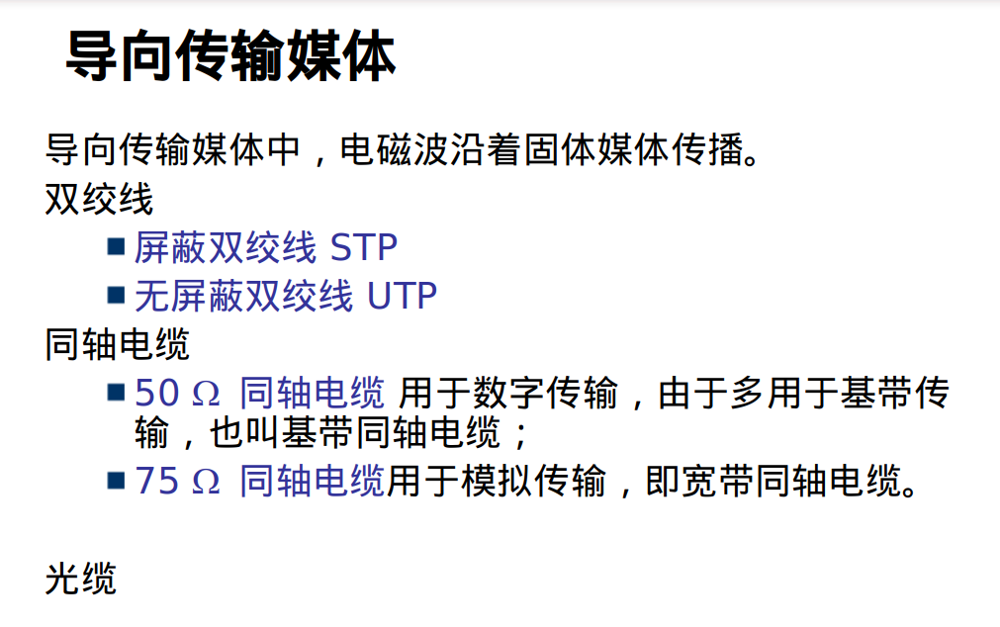

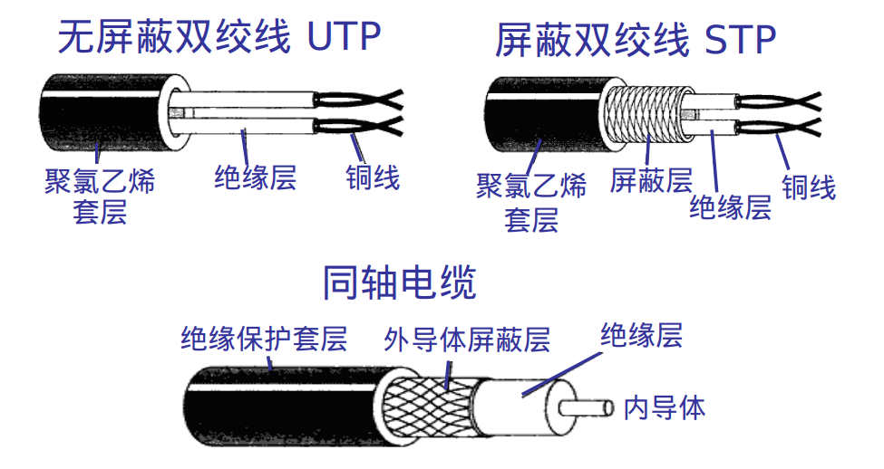

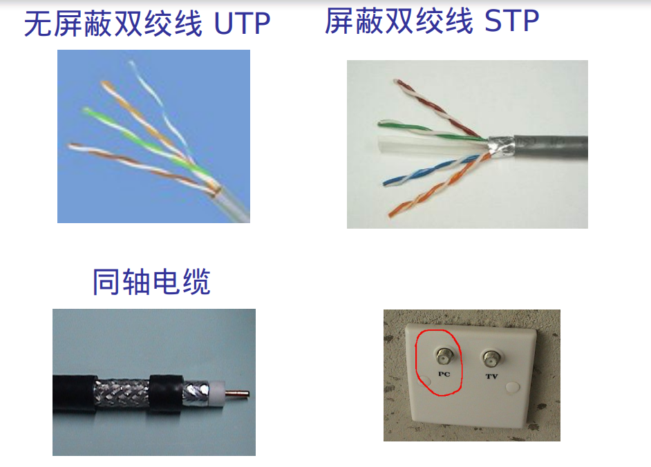

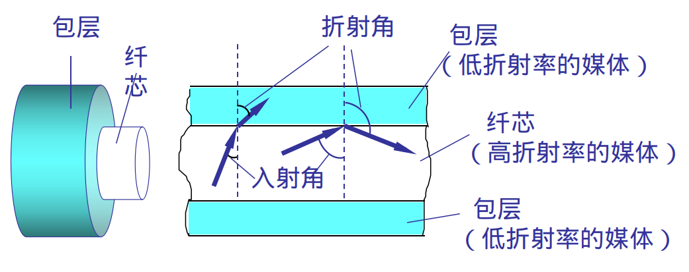

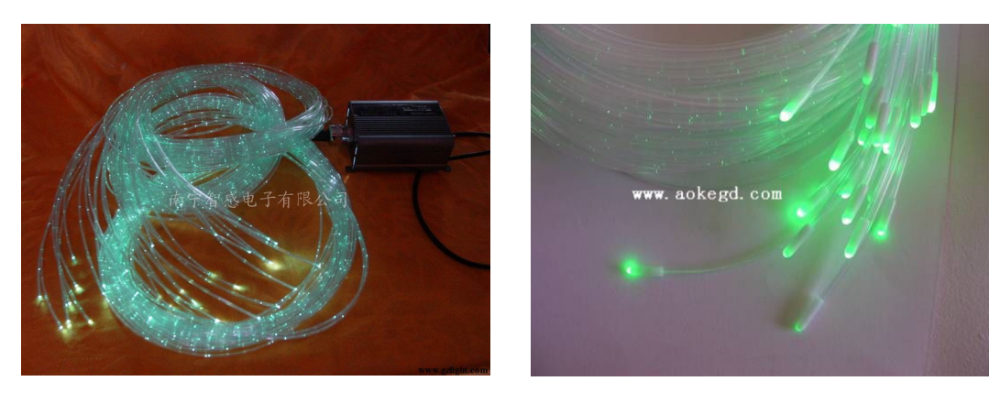

#### 非导线传输媒体

自由空间，电磁波传输为无线传输。微波在空间主要是直线传输。

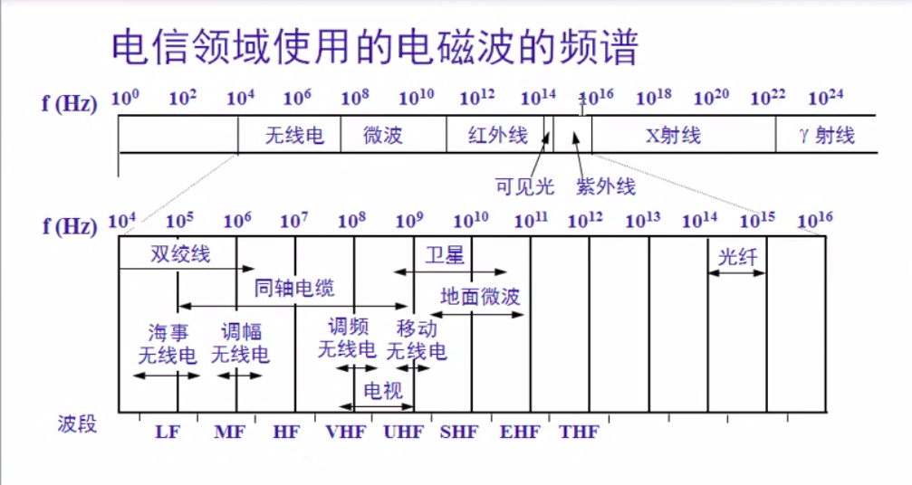

#### 物理层设备

##### 集线器

特点：在地址中只起到信号放大和重发作用，目的是放大网络的传输范围，不具备***信号的定向传送能力**。收到一个信号全部端口转发，不能够定向传送。

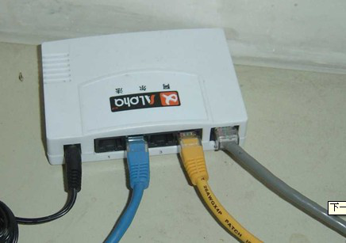

集线器是一个大的冲突域。

### 信道复用技术

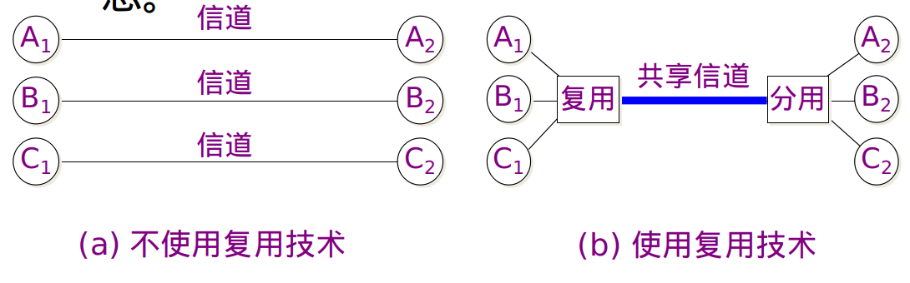

- 频分复用

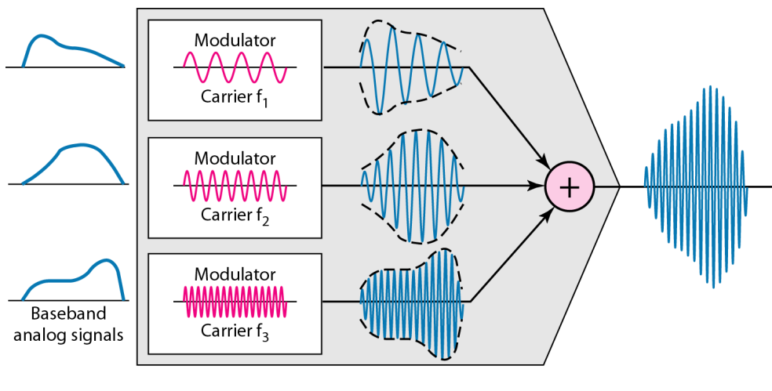

- 时分复用

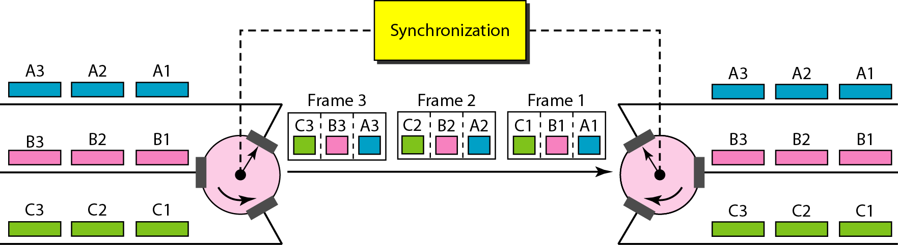

- 波分复用

就是光的频分复用

### 数字传输系统

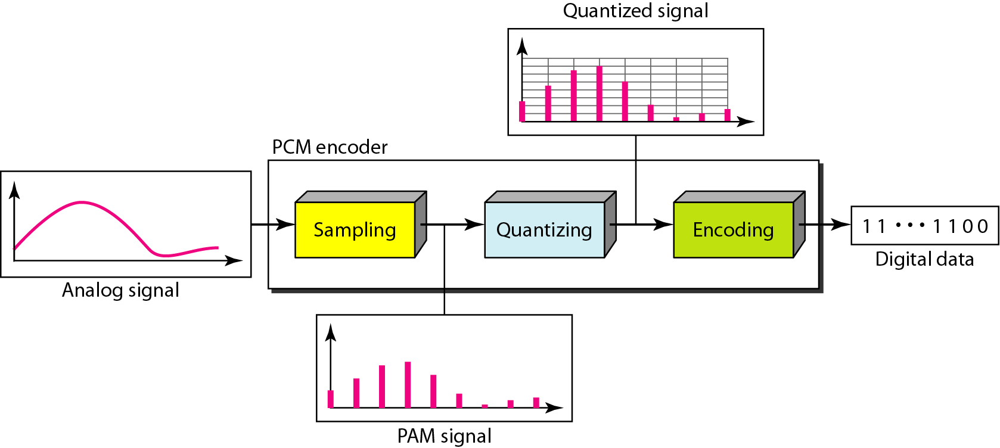

DMT技术

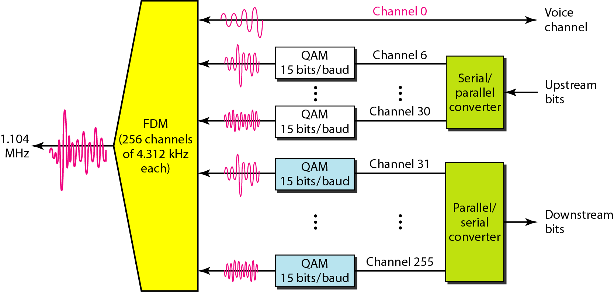

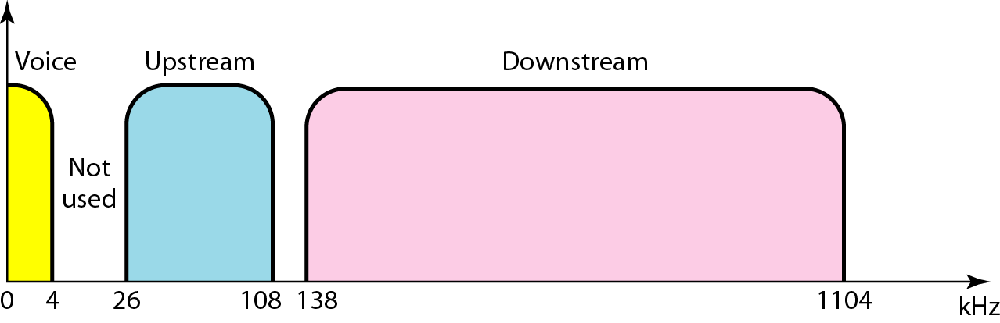

