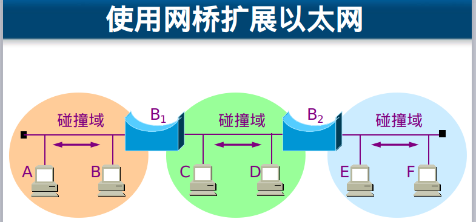

## 计算机网络(三) 数据链路层
## 王道烩 2018.9.23 

### 1. 基本概念

在数据链路层只关注数据在数据链路层之间的传输。

#### 1.1 数据链路层的信道类型

- 点到点信道：一对一的点对点通信方式
- 广播信道：一对多的广播通信方式，链接主机比较多，需要协议。

#### 1.2 链路与数据链路

- 链路：一条点到点的物理线路段，中间没有任何其他交换节点。
- 数据链路：除了物理线路外，还必须有通信协议来控制这些数据的传输。若把实现这些协议的硬件和软件加到链路上，就构成了数据链路。

#### 1.3 帧

将数据包加上头，尾 ，物理地址以及校验部分就成了帧。

### 2. 三个基本问题

#### 2.1 封装成帧

在一段数据的前后分别添加首部和尾部，然后就构成了一个帧。确定帧的界限。

#### 2.2 透明传输

#### 2.3 差错检验

在传输的过程中，将要传输的数据增加一些检验项。常用的是循环冗余检验。

### 3 点到点的数据链路层

**PPP协议**

### 4 局域网，使用广播信道的数据链路层

局域网的拓扑

发送数据都可以接收到，不安全。

使用集线器时，仍然将一个信号发送给所有的端口，所有计算机都可以收到这个信号，这叫做广播。

使用的协议为**带冲突检测的载波监听多路访问**。

- 多点接入：许多计算机以多点接入的方式连接到一根总线上。
- 载波监听：每一个站在发送数据之前先要检测一下总线上是否有其他计算机在发送数据，如果有，则暂时不要发送数据，以免发生碰撞。 

使用 CSMA/CD 协议的以太网不能进行全双工通信而只能进行双向交替通信（半双工通信）。

最先发送数据帧的站，在发送数据帧后至多经过时间 2t(两倍的端到端往返时延）就可知道发送的数据帧是否遭受了碰撞。

### 以太网

以太网提供的服务是不可靠的交付，即尽最大努力的交付。当接收站收到有差错的数据帧时就丢弃此帧，其他什么也不做。差错的纠正由高层来决定。如果高层发现丢失了一些数据而进行重传，但以太网并不知道这是一个重传的帧，而是当作一个新的数据帧来发送。

#### MAC层

在局域网中，硬件地址又称为物理地址或MAC地址。48位且全球唯一。前24位代表厂家，后24位厂家自己分配，为拓展标识符。

### 拓展以太网

使用网桥来拓展局域网

在数据链路层扩展局域网是使用**网桥**。网桥工作在数据链路层，它根据 MAC 帧的目的地址对收到的帧进行转发。网桥具有过滤帧的功能。当网桥收到一个帧时，并不是向所有的接口转发此帧，而是先检查此帧的目的 MAC 地址，然后再确定将该帧转发到哪一个接口。网桥能够隔离冲突，基于MAC地址转发。

后来网桥的口越来越多，每个口直接接计算机，然后网桥就变成了**交换机**。交换机能够学习MAC地址表。同时交换机的口可以进行缓冲，而且带宽独享，全双工，而且安全。

交换机优点：

- 端口带宽独享
- 安全
- 基于MAC地址转发
- 能够通过学习创建MAC地址表。每一个MAC地址对应一个接口。

### 高速以太网

