## 计算即网络(四)  网络层
## 王道烩  2018.9.23

### 1 网络层提供的服务

尽力转发数据包，不负责数据包的顺序和丢失情况，可靠传输是传输层的工作。

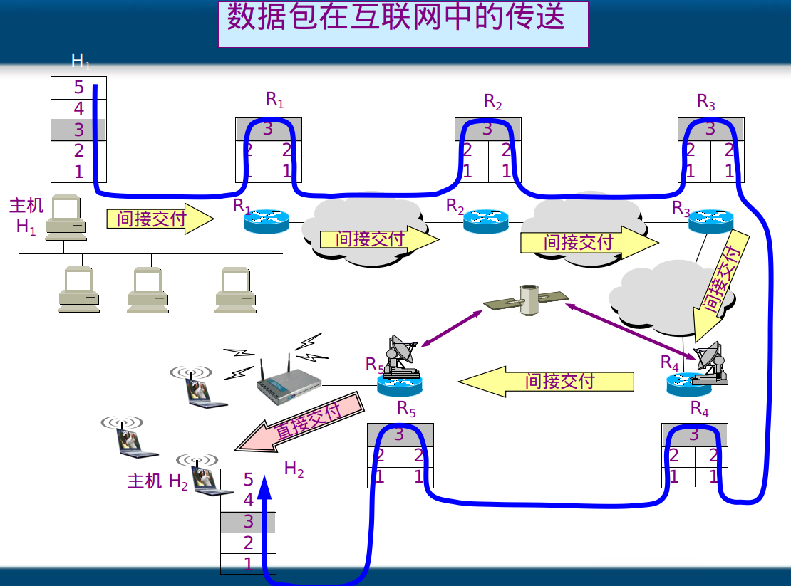

网络层只负责根据IP地址选择最优路径。

### 2 网络设备和OSI参考模型之间的关系

计算机通信的过程，本网段通信，跨网段通信的过程

发动端：

- 应用层：程序准备要传输的文件
- 传输层：将文件分段，编号
- 网络层：添加目标IP地址和源IP地址
- 数据链路层：两种情况：如果是一个网段，(通过源IP目标IP以及子网掩码来判断)，然后就通过ARP协议广播来获得目标IP的MAC地址；如果不是一个网络，那么就这个数据发送给路由器，(网关)，然后ARP广播得到路由器的MAC地址，这样就能够发送出去。

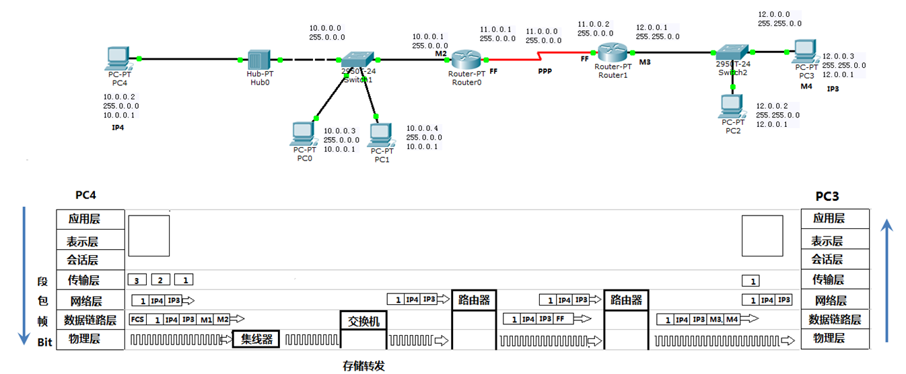

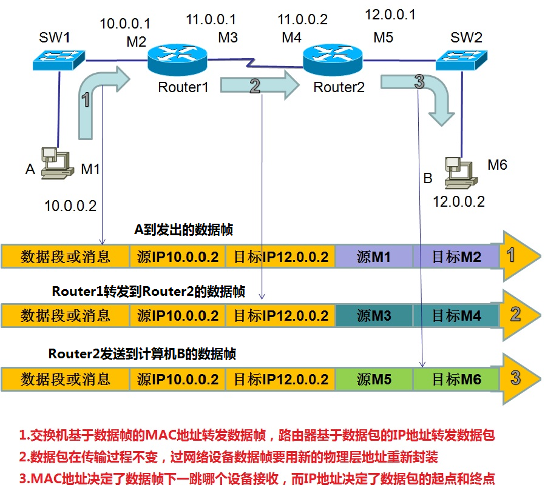

集线器是一层设备，交换机是二层设备，路由器是三层设备

### 3 网络层协议

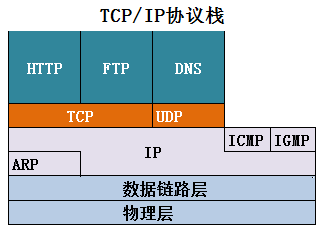

#### 3.1 ARP and RARP

ARP协议为IP协议提供服务。

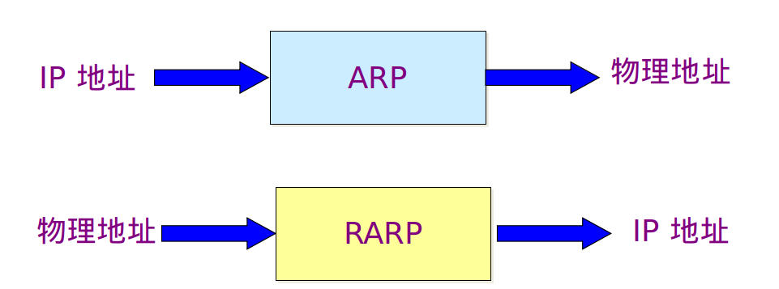

不管网络层使用的是什么协议，在实际网络的链路上传送数据帧时，最终还是必须使用硬件地址。 每一个主机都设有一个 ARP 高速缓存(ARP cache)，里面有所在的局域网上的各主机和路由器的 IP 地址到硬件地址的映射表。当主机 A 欲向本局域网上的某个主机 B 发送 IP 数据报时，就先在其 ARP 高速缓存中查看有无主机 B 的 IP 地址。如有，就可查出其对应的硬件地址，再将此硬件地址写入 MAC 帧，然后通过局域网将该 MAC 帧发往此硬件地址。

**ARP只能在一个网络进行广播，不能跨路由器。**

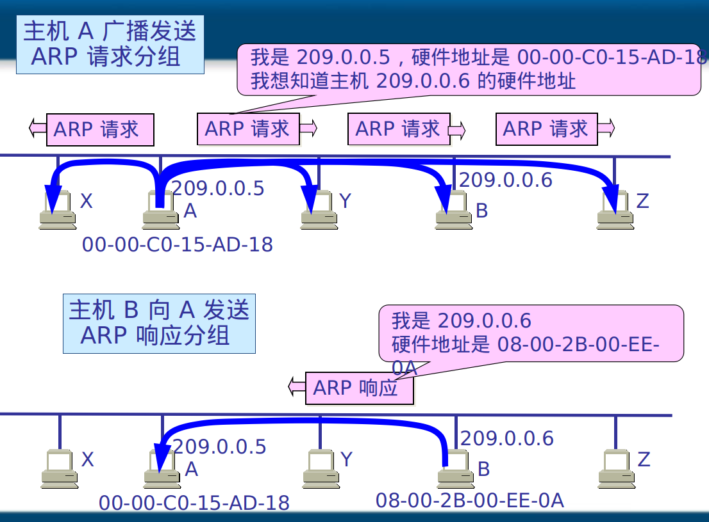

高速缓存的作用：

为了减少网络上的通信量，主机 A 在发送其 ARP 请求分组时，就将自己的 IP 地址到硬件地址的映射写入 ARP 请求分组。当主机 B 收到 A 的 ARP 请求分组时，就将主机 A 的这一地址映射写入主机 B 自己的 ARP 高速缓存中。这对主机 B 以后向 A 发送数据报时就更方便了。

ARP 是解决同一个局域网上的主机或路由器的 IP 地址和硬件地址的映射问题。如果所要找的主机和源主机不在同一个局域网上，那么就要通过 ARP 找到一个位于本局域网上的某个路由器的硬件地址，然后把分组发送给这个路由器，让这个路由器把分组转发给下一个网络。剩下的工作就由下一个网络来做。从IP地址到硬件地址的解析是自动进行的，主机的用户对这种地址解析过程是不知道的。只要主机或路由器要和本网络上的另一个已知 IP 地址的主机或路由器进行通信，ARP 协议就会自动地将该 IP 地址解析为链路层所需要的硬件地址。

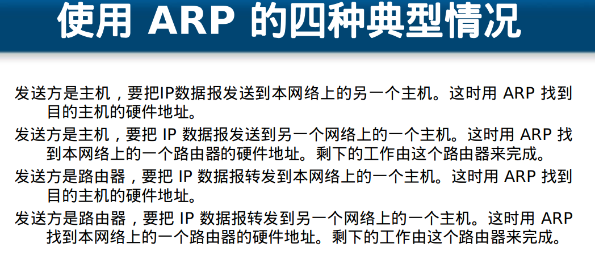

**逆地址解析协议 RARP**使只知道自己硬件地址的主机能够知道其 IP 地址。

#### 3.2 ICMP

为了提高 IP 数据报交付成功的机会，在网际层使用了网际控制报文协议 ICMP (Internet Control Message Protocol)。ICMP 允许主机或路由器报告差错情况和提供有关异常情况的报告。ICMP 不是高层协议，而是 IP 层的协议。ICMP 报文作为 IP 层数据报的数据，加上数据报的首部，组成 IP 数据报发送出去。

ICMP用来测试网络层是否畅通，检测故障使用，使用最多的命令式PING。

PING（Packet Internet Grope），因特网包探索器，用于测试网络连接量的程序。Ping发送一个ICMP回声请求消息给目的地并报告是否收到所希望的ICMP回声应答。

TTL：生存时间，过一个路由器减一。减到零就丢掉，防止一直转。Linux: 64  Windows:128.  Unix:255。修改TTL可以查看途径路由器的信息。

time:延时

`pathping`跟踪数据包路径，计算丢包情况。

#### 3.3 IP数据包

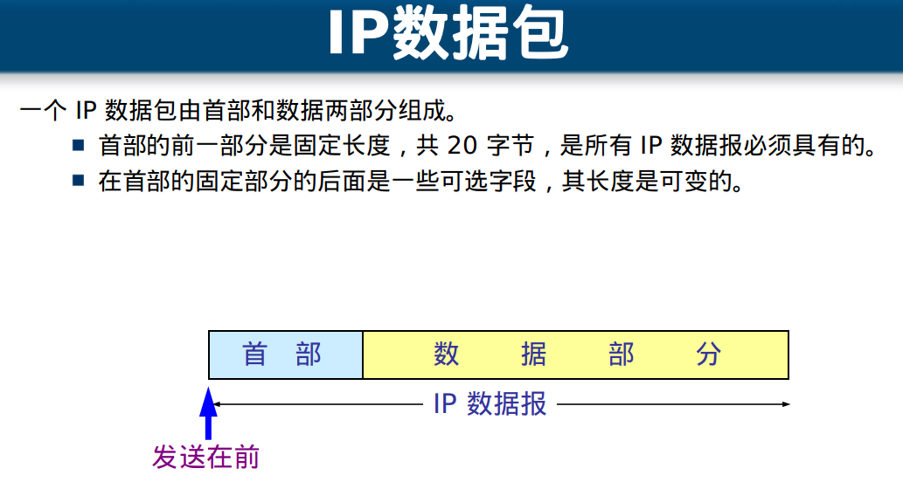

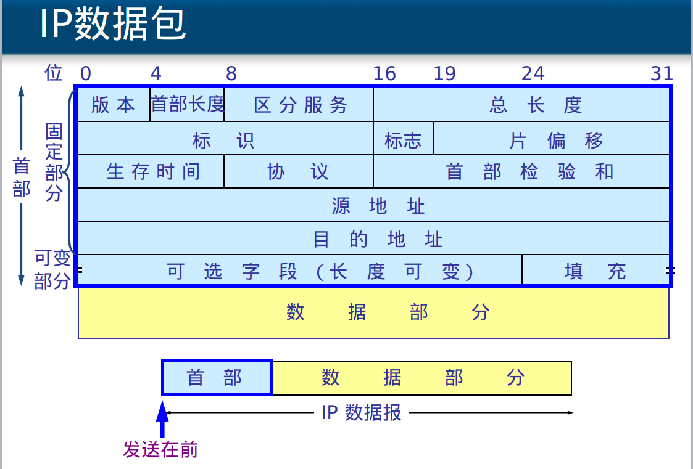

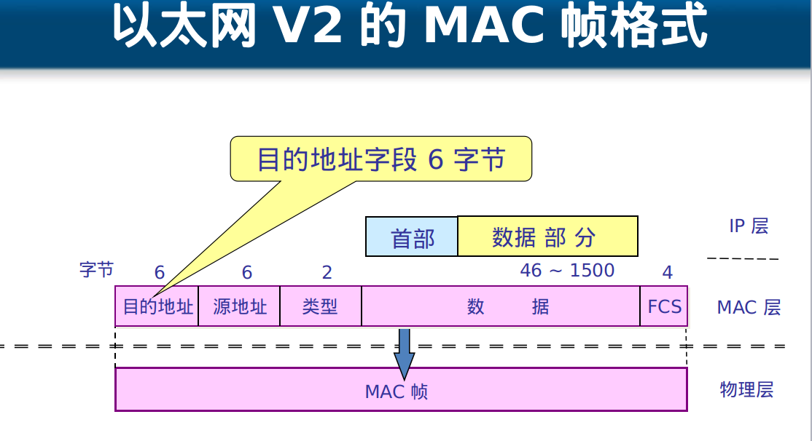

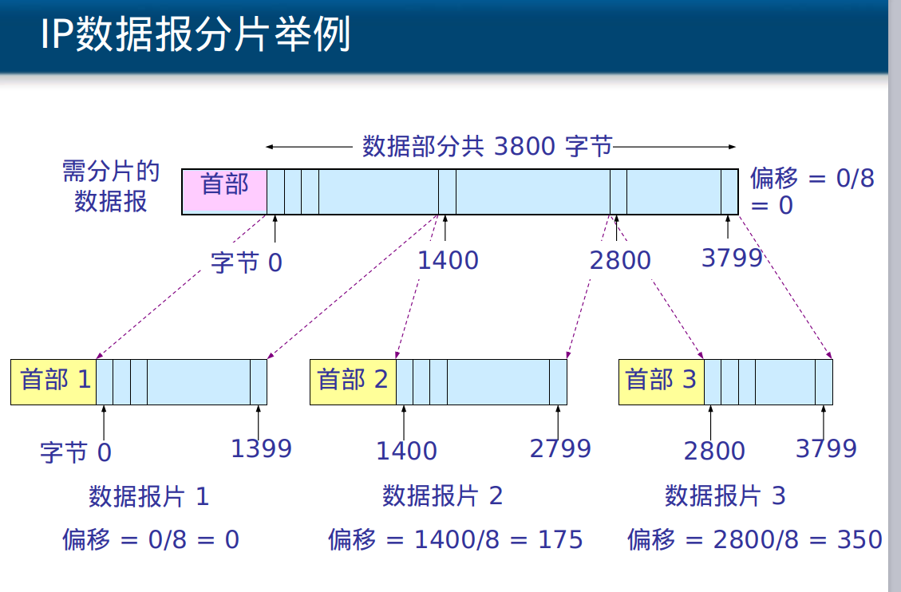

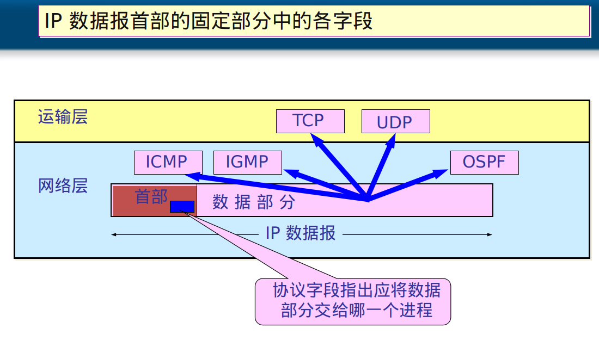

#### IP协议

一个路由器的路由表可以静态路由或者动态路由，但是静态路由是管理源告诉，动态路由是路由器通过IP协议自己学习路由表。

网络畅通的条件：

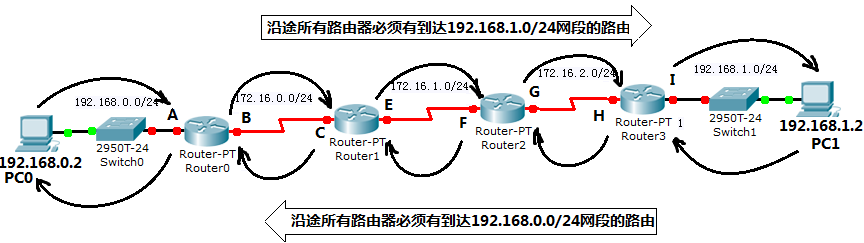