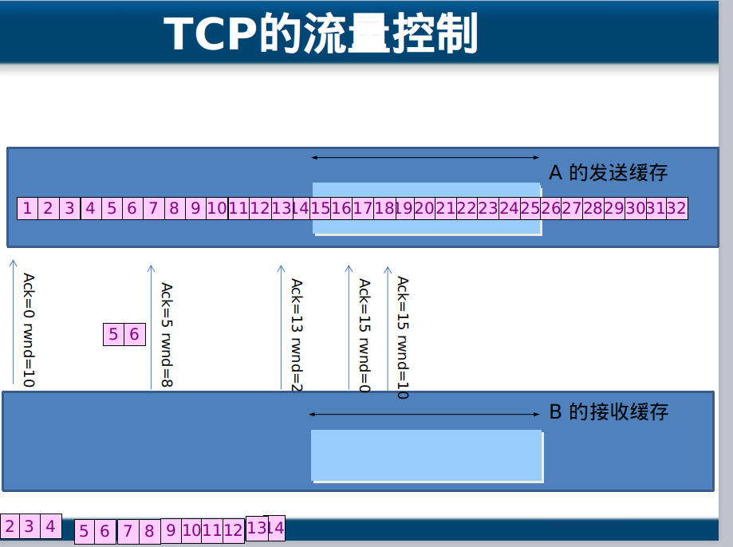

## 计算机网络(五) 传输层
## 王道烩 2019.9.23

### 1. 传输层的功能

- 传输层协议UDP和TCP
- 网络安全
- TCP可靠传输的实现
- TCP的流量控制
- TCP的拥塞控制
- TCP的运输连接管理

### 2. TCP与UDP

- TCP：传输控制协议(Transmission Control Protocol)
- UDP：用户数据报协议(user Data Protocol)

### 3. TCP的使用情况

**需要将要传输的文件分段**，传输，建立会话，可靠传输，流量控制功能，比如服务器发送过快，处理不过来。QQ传文件。

### 4. UDP的使用情况

**一个数据包就能够完成数据通信，不分段，不需要建立会话，不需要流量控制，不可靠传输。如域名解析服务，QQ聊天。屏幕广播。

查看会话使用`netstate -pantu`

### 5. 传输层协议和应用层协议之间的关系

传输的TCP或者UDP加上端口就可以标志一个应用程序。

常见的应用层协议使用的端口

- http  TCP+80
- https TCP+443
- RDP TCP+2289
- ftp TCP+21
- SQL TCP+1433
- DNS UDP+53

### 6. 服务和应用层协议之间的关系

可以在网卡设置让访问哪些端口的能够进入。网卡就像是一个大门。可以只开放特定的端口，或者直接将服务停止，这样可以实现网络安全。

服务使用TCP或UDP的端口贞听客户端请求，客户端可以使用IP地址定位服务器，使用目标端口，定位服务，可以再服务器网卡上设置只开放必要的端口，实现服务器网络安全。

### 7. 传输层的主要功能

- 传输层为应用进程之间提供端到端的逻辑通信。
- 传输层还要对收到的报文进行差错检测。
- 传输层提供面向连接和无连接的服务。

端口号用一个16位端口号进行标志，端口号只具有本地意义，端口号只是为了标志本计算机应用层中的各进程，在因特网中不同计算机的相同端口之间是没有联系的。

客户端一般是开一个高端口，服务一般是固定端口。

### 8. UDP主要特点

- 无连接
- 不保证可靠交付，不使用拥塞控制
- 面向报文。
- 支持一对一，一对多，多对一和多对多
- 首部开销小，只有8个字节。

UDP首部就八个字节，源端口，目标端口，长度指整个首部和数据的长度，检验和是需要网络层的一些信息来计算检验和。网络层的那些称为伪首部。

### 9. TCP主要特点

- TCP是面向链接的传输层协议
- 每一条TCP链接只能有两个端点，每一条TCP链接只能是点对点的。
- TCP提供可靠交付的服务
- TCP提供全双工通信。传输的过程中，接收方必须给发送方一些反馈。
- 面向字节流。

TCP 把连接作为最基本的抽象.每一条 TCP 连接有两个端点。TCP 连接的端点不是主机，不是主机的IP 地址，不是应用进程，也不是传输层的协议端口。TCP 连接的端点叫做套接字(socket) 。端口号拼接到IP 地址即构成了套接字。

### 10.  可靠传输的原理

#### 10.1 停止等待协议

当B的确认丢失的时候，A再发一次，然后B把第二次收到的丢掉，并发送收到。

当确认迟到的时候，A收到迟到的确认什么都不做。

使用上述的确认和重传机制，我们就可以在不可靠的传输网络上实现可靠的通信。这种可靠传输协议常称为自动重传请求ARQ (Automatic Repeat reQuest)。ARQ 表明重传的请求是自动进行的。接收方不需要请求发送方重传某个出错的分组 。

但是上述的信道利用率太低。

在发送端有一个发送窗口，收到一个确认之后就将发送窗口向后移动一位。发送窗口的内容需要保存在缓存中。

接受方一般使用**累计确认**的方法.如果收到了1 2 4， 3丢失了，这样只需要发送2确认收到，不需要发送1确认收到。

### 11. TCP报文格式

源端口和目的端口字段——各占 2 字节。端口是传输层与应用层的服务接口。传输层的复用和分用功能都要通过端口才能实现。

序号表示这个数据段的第一个字节代表整个传输文件的第几个字节。

确认号的用处
当接收方接收到一个数据包的时候，检查这个数据包最后一个字节代表哪一个字节，然后返回下一个字节作为确认号，希望发送发发送。

数据偏移:由于TCP首部不是固定长度，所以数据偏移表示数据部分从那个地方开始的。

URG:urgent 优先传动
ACK:0 确认号无效，1确认号有效，在接收方向发送发确认时有用。
SYN：1 表示同意建立会话。
ACK和SYN两个字段在请求会话和建立会话的时候和正常不一样。

可以使用上述两个字段来进行服务器攻击。伪造IP来请求和服务器进行建立会话。可以使服务器消耗很多资源。

PSH：如果是1的话，结束端接受到之后，会提前提前提交给应用程序。

RST：如果是1，说明出现严重错误，需要重新建立连接。如在浏览器中点击x就会重新建立链接。

FIN：如果是1的话表示释放链接。如服务器端网页发送完毕。

窗口：

在进行通信之前，发送方和接收方都需要告诉对方自己的缓存是多少。然后对方根据自己的接受缓存设置对应的发送缓存。

紧急指针表示了URG指示的需要紧急传送内容的最后一个位置。

### 12. TCP实现有效传输详细情况

#### 12.1 以字节为单位的滑动窗口

主要是通过发送方和接收方两者的窗口来进行移动。接收方发动确认收到之后就可以将接受窗口向后移动，发送方接收到接收方的确认信息之后就可以将发动窗口向后移动。

当计算机网速变化的不是很剧烈的时候，alpha的值可以稍微小一些，网速变化较大的时候，可以稍微大一些。

#### 12.2 流量控制

TCP进行流量控制的方法主要是通过接收方向发送发发送确认信息的时候，附带自己现在的窗口的大小，这样就能够实现流量控制。

### 13. TCP的传输连接管理

传输有三个阶段：

- 连接建立
- 数据传送
- 连接释放

TCP连接的建立都是采用客户服务器方式。主动发起连接建立的应用进程叫做客户(client)，被动等待连接建立的应用进程叫做服务器(server)。

为什么需要三次握手：

就相当于两个人之间相互问能听到我说话么。B如果向确认A听得到自己说话，需要A的第三次向B发送确认。

