## 计算机网络(六) 应用层
## 王道烩  2018.9.25

### 1. TCP/IP协议

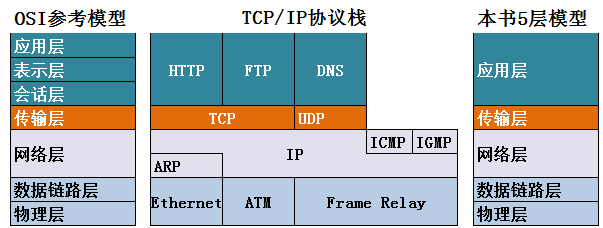

每一个应用层协议就代表着一种服务。

- 域名系统DNS(Domain Name System)
- 动态主机配置协议DHCP
- 文件差孙虎协议FTP(File Transfer Protocol)
- 远程终端协议TELNET
- 远程桌面RDP
- 万维网WWW(World Wide Web)
- 电子邮件(SMTP P0P3 IMAP)

### 2. DNS服务

在输入一个域名的时候，需要向一个DNS服务器将域名变成IP地址。

#### 2 .1 域名：

需要全球唯一。在使用的时候需要去注册。
所有域名是以点开始，完整的后面都应该有一个点，如www.baidu.com.

- 根 .
- 顶级域名 com edu cn org gov 代表网站的性质。
- 二级域名 91xueit inhe 自己申请的。

申请的时候，只要91xueit.com是全球唯一，那么就可以申请。

那么就可以使用下面的来用

www.91xueit.com

mail.91xueit.com

ftp.91xueit.com

- 三级域名 dba www.dba.91xueit.com

注册的时候只需要注册二级域名就行，其他的对应的也都是全球唯一的。

域名解析的时候可以直接`ping `，也可以使用`nslookup`。

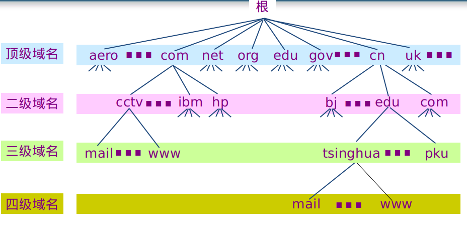

#### 2.2 域名解析的过程

域名解析是一种分布查询的技术。

每台计算机有缓存，保存最近解析的域名。然后每一个计算机配有一个DNS服务器，如果这个DNS服务器没有解析，那么将这个请求转发给根DNS域名解析器。

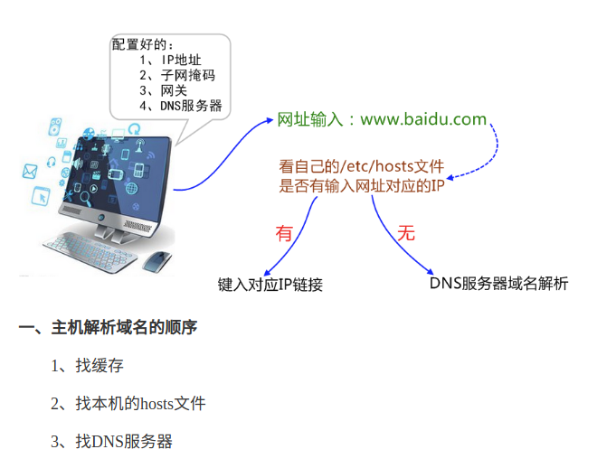

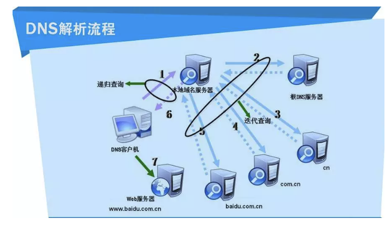

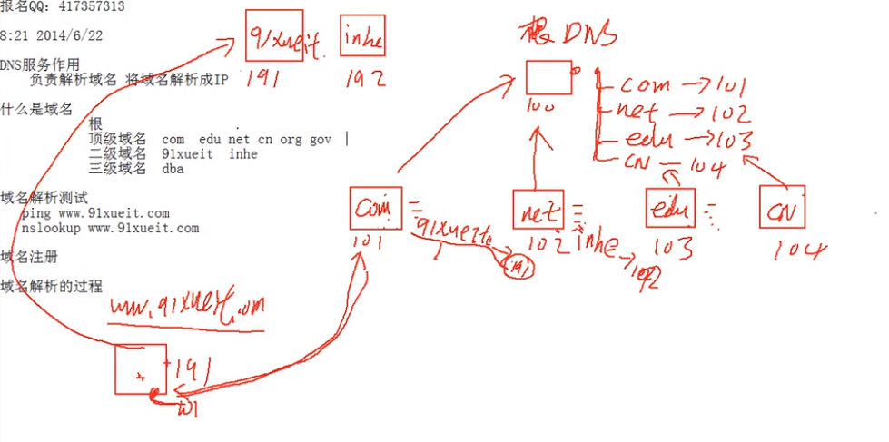

#### 2.3 安装自己的DNS服务器

-  解析内网自己的域名
- 降低到Internet的域名解析流量
- 域环境

### 3. DHCP(动态主机配置协议)

- 静态IP地址：服务器使用
- 动态IP地址：用户使用

### 4. FTP协议

FTP使用的是两个TCP连接。

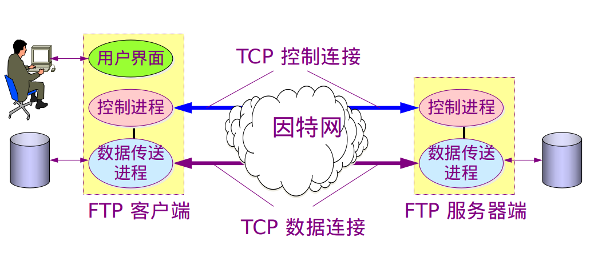

- 主动模式：ftp客户端告诉ftp服务器使用什么端口贞听，ftp服务器和ftp客户端的这个端口建立链接，源端口是20.

- 被动模式：ftp服务器告诉ftp客户端自己打开的一个新端口，然后ftp客户端请求建立连接。

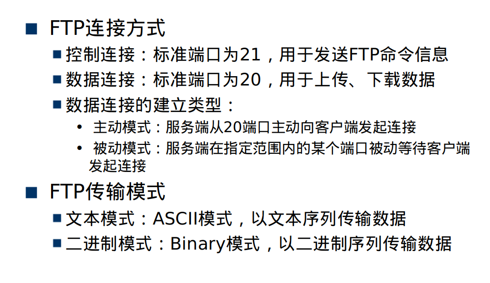

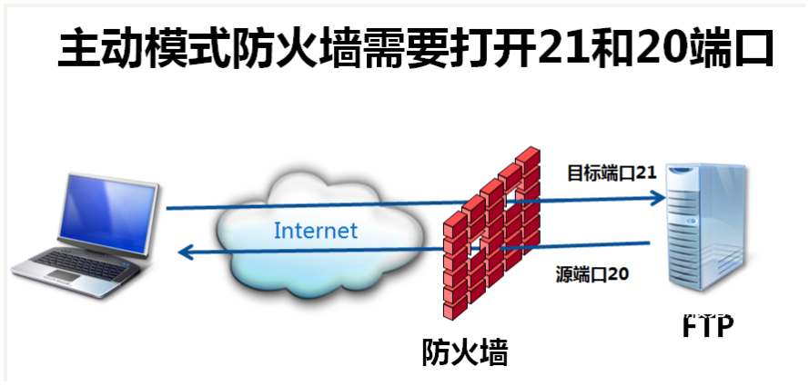

FTP服务器端如果有防火墙，需要在防火墙开21 20端口，使用主动模式进行数据链接。

### 5. HTTP协议 

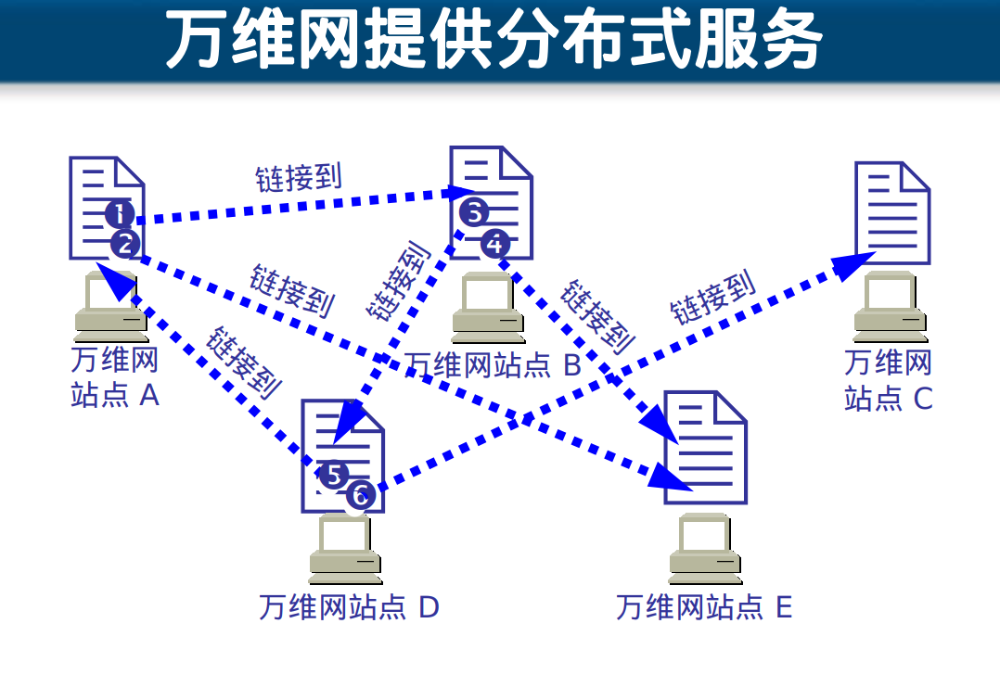

万维网不同网页之间能够链接到。
搜索引擎将网页抓取下来，然后按照关键字进行排序，供用户查询。

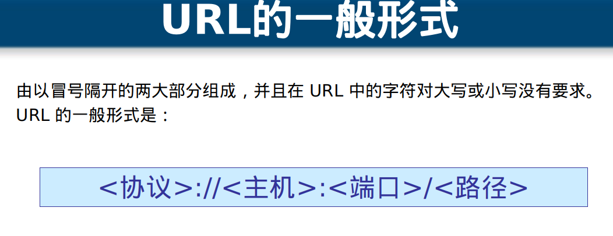

### 6. 使用Web代理服务器访问网站

不直接访问网站，而是通过一个代理服务器来访问某网站。

- 可以节省内网访问Internet的带宽。

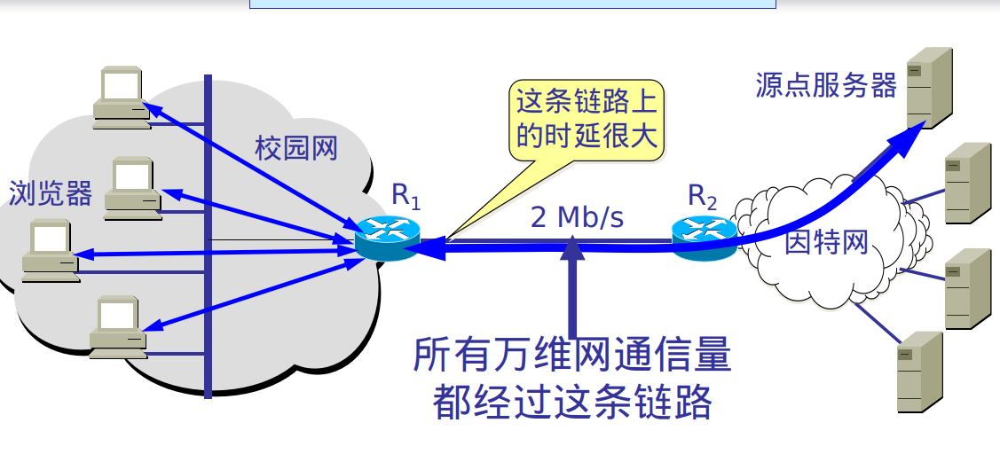

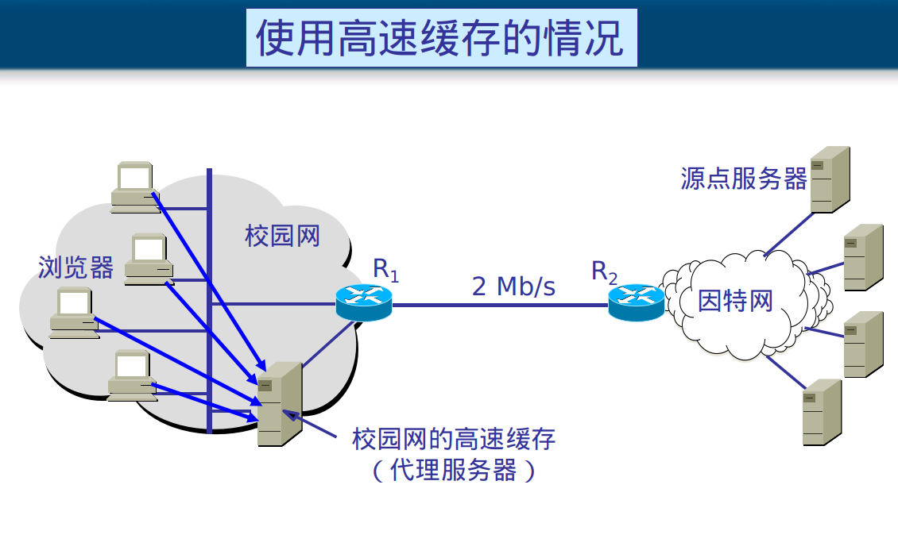

- 翻墙。

- 隐藏自己的IP。

### 7. 邮件服务

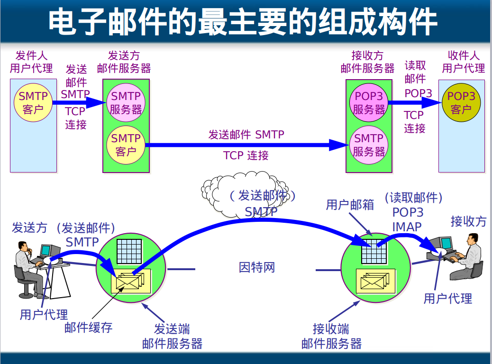

