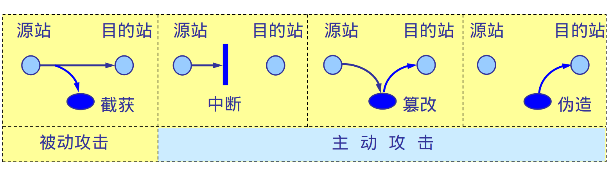
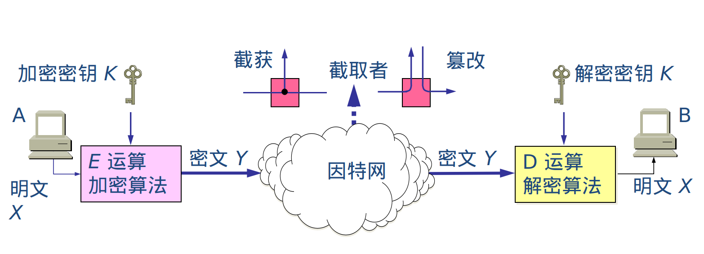
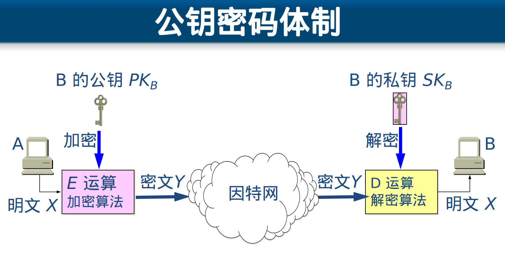
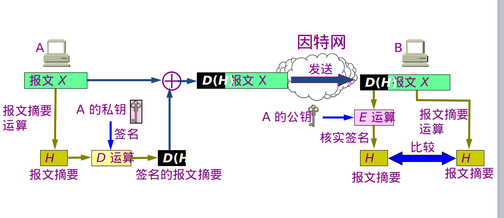
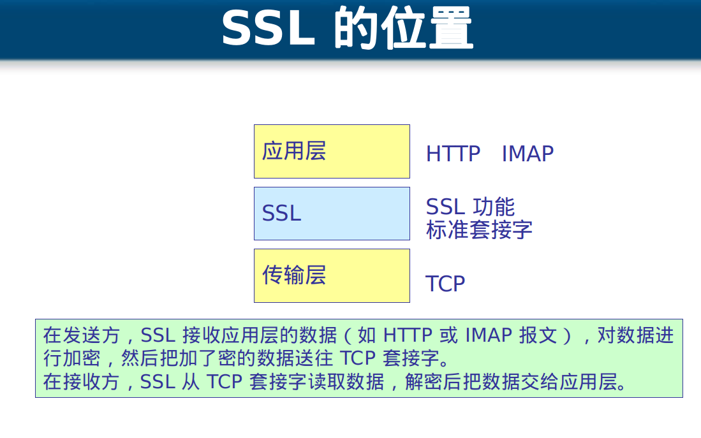

## 计算机网络(七)
## 王道烩 2018.9.26

### 1. 计算机安全包括的方面

- 数据存储安全
- 应用程序安全
- 操作系统安全
- 网络安全
- 物理安全
- 用户安全教育

### 2. 网络安全概述

计算机网络在通信的时候面临一下失踪威胁：

- 截获：从网络上窃听他人的通信内容
- 中断：有意中断他人在网络上的通信
- 篡改：故意篡改网络上传送的报文
- 伪造：伪造信息在网络上传输

截获信息的攻击称为被动攻击，而更改信息和拒绝用户使用资源的攻击称为主动攻击。

### 3. 恶意程序

- 计算机病毒：传统其他程序的程序，传染是通过修改其他程序来把自身或起变种复制进去。

- 计算机蠕虫：消耗系统的资源，CPU，内存。不一定更改系统设置。通过网络的通信功能将自身从一个节点发送到另一个节点并启动运行的程序。

- 木马：一种程序，执行的功能超过所声称的功能。如将某个文件夹备份到远程一个地方，木马需要进行通讯。

- 逻辑炸弹：运行环境满足某种特定条件时执行其他特殊功能的程序。

### 4. 两类加密技术

#### 4.1 对称加密

加密密钥和解密密钥是同一个密钥。

这种加密方式不哈，因为首先密钥不能通过网路传输，同时如果存在多个人的话，没两个人之间都要有一个密钥。

优点是效率高。

加密包括加密算法和加密密钥，算法是公开的，但是加密密钥是私有的。

在加密前，先对整个明文进行分组。每一个组长为 64 位。然后对每一个 64 位 二进制数据进行加密处理，产生一组 64 位密文数据。最后将各组密文串接起来，即得出整个的密文。
使用的密钥为 64 位（实际密钥长度为 56 位，有 8 位用于奇偶校验)。

#### 4.2 非对称加密

加密秘钥和解密秘钥是不同的，称为秘钥对，公钥和私钥。

两种用法公钥加密私钥解密 和 私钥加密公钥解密。

公钥和私钥两者无法相互推导出。

在公钥密码体制中，加密密钥(即公钥) PK 是公开信息，而解密密钥(即私钥或秘钥) SK 是需要保密的。加密算法 E 和解密算法 D 也都是公开的。虽然秘钥 SK 是由公钥 PK 决定的，但却不能根据 PK 计算出 SK。

加密过程就是，接收方将自己的公钥告诉发送方，发送方通过公钥进行加密，然后接收方使用自己的私钥进行解密，如果内容被截获之后，不能够通过公钥进行解出来的。

#### 4.3 非对称加密细节

其实非对称加密使用了对称加密。可以首先用一个东西来给内容进行加密，如123abc，然后在使用公钥对123bac进行加密，这样接收方首先通过私钥接出123agc，然后再使用123abc对内容进行解密。

#### 5. 数字签名

能够防止抵赖，也能够检查签名之后内容是否被更改。

发送方A将内容通过一个单向散列函数变成一个128位的摘要，这个摘要就相当于这个文件的指纹，与文件一一对应。然后用A的私钥对摘要进行加密，加密后的摘要就是这个文件的签名。

然后发送方将内容明文，私钥加密后的摘要以及发送方A的公钥，接收方接收到明文之后，通过单向散列函数得到一个摘要，然后在通过A的公钥来解摘要，如果两个摘要不一样，说明文件被修改过。

#### 6. 证书颁发机构(CA)

依赖一些信赖的机构为公司颁发密钥对。

#### 7. SSL

一些https服务就是使用了安全套接字。